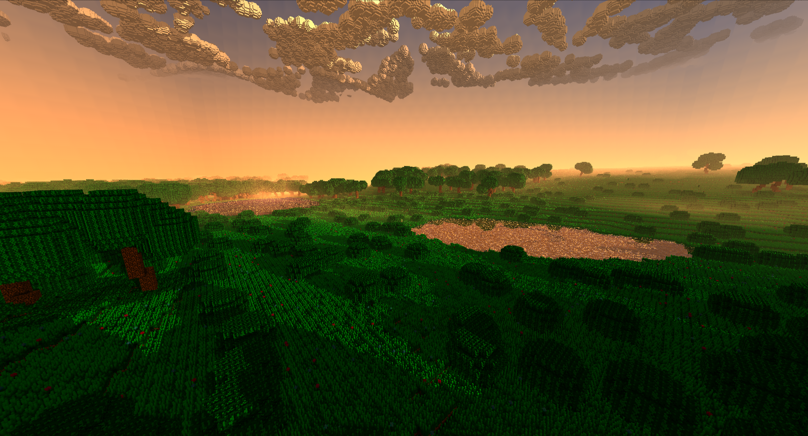

# Conspiracraft

# Getting Started
- Do not run the jar directly. 
- Open a cmd prompt in the folder of the jar. 
- Paste this without the quotes: "java -jar Conspiracraft-0.3-SNAPSHOT-standalone.jar"
- Hit enter. 
- Wait a minute for the world to generate. 

# Important Information
- This is just a technical demo at the moment, do not expect gameplay yet. 
- Non-nvidia gpus, linux, and mac have not been tested. 
- To access save data, press WIN+R, paste this without the quotes "%appdata%/conspiracraft", and hit enter.

# Keybinds 
- Shift: Sprint
- Shift + CTRL: Crawl
- CTRL + LMB: Break a corner of a block
- LMB: Break a block 
- RMB: Place a block 
- MMB: Pick a block 
- Q / E: Cycle the selected block out of your stack
- F3 + Q / E: Cycle the block type of your selected block
- F3 + Shift + Q / E: Cycle the block subtype of your selected block
- X: Toggle flight 
- Capslock: Super sprint (only when flying) 
- T: Skip forward in time 
- F1: Toggle UI 
- F4: Toggle shadows
- F11: Toggle fullscreen
- F3 + R: Toggle reflections
- F3 + S: Toggle shadows
- F3 + T: Reload texture atlas
- F3 + A: Cycle ao quality
- F3 + C: Toggle creative mode
- F3 + Up: Increase render distance
- F3 + Down: Decrease render distance
- F3 + Shift + Up: Speed up time by +25%
- F3 + Shift + Down: Slow down time by -25%

# Credits 
Sound effects are sourced from [ZapSplat](https://www.zapsplat.com/)